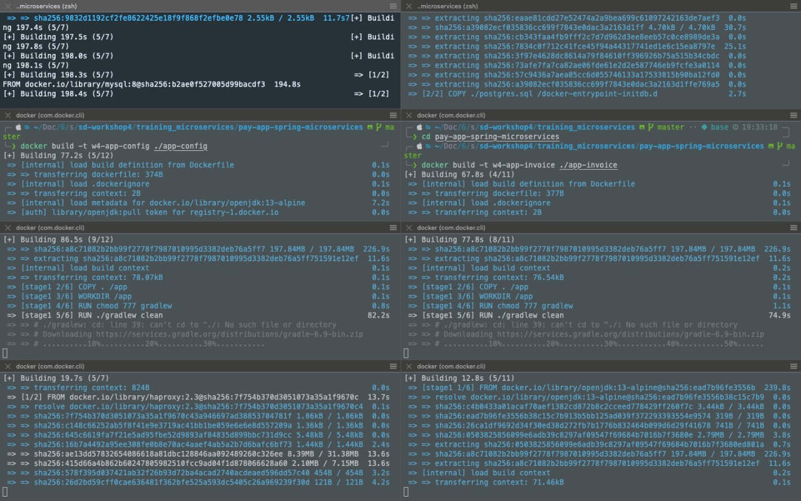
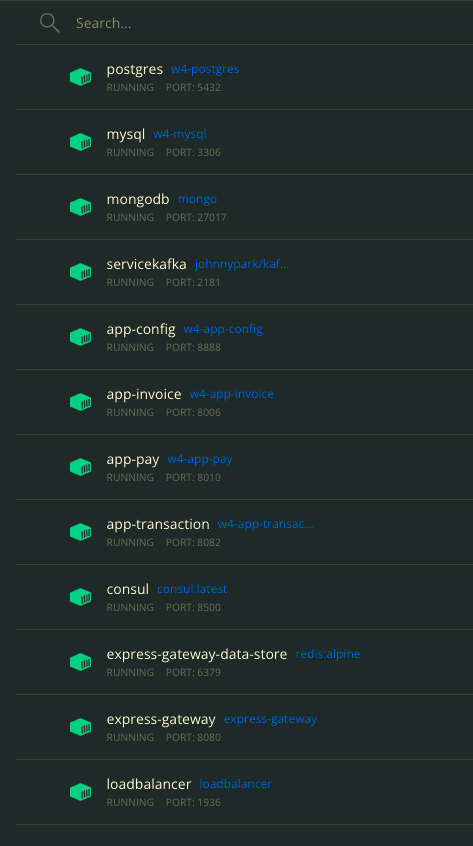
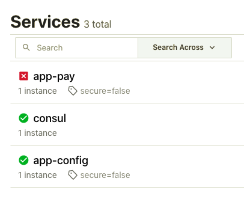

# Authors

* Christian Gallo Peláez 

* Sebastián García Acosta
# Workshop4

Integrate microservice app-pay to:
- Consul
- Modify LoadBalancer to support path /pay pointing to app-pay microservice 
- Modify API GW to support redirect to app-pay microservice

till Martes 22/ 11:59pm 

* We modified the sd-workshop4/training_microservices/pay-app-spring-microservices/app-config/src/main/resources/application.properties file to point to a GitHub repository that we created with the inclusion of the Consul configuration of the app-pay microservice

* We added the apppay backend in the configuration of the HAproxy to point to the app-pay microservice under the localhost:8010/pay uri

* We added the URI redirection request int he express-gateway when creating credentials
# Get started

```bash
git clone git@github.com:icesi-ops/training_microservices.git
cd training_microservices
git checkout 0f4bac8ca6ab86df2b9c61aaa7de81479398bf2d
cd pay-app-spring-microservices

# Create docker network
docker network create distribuidos 

# Pull required external docker images
docker pull mongo
docker pull johnnypark/kafka-zookeeper
docker pull consul
docker pull redis:alpine
docker pull express-gateway

# Create DB images 
docker build -t w4-mysql resources/mysql
docker build -t w4-postgres resources/postgres

# Create custom images 
docker build -t w4-app-config ./app-config
docker build -t w4-app-invoice ./app-invoice
docker build -t w4-app-pay ./app-pay
docker build -t w4-app-transaction ./app-transaction
docker build -t loadbalancer ./haproxy


docker run  -p 5432:5432 \
            -e POSTGRES_PASSWORD=postgres \
            -e POSTGRES_DB=db_invoice \
            -d \
            --network distribuidos \
            --name postgres \
            w4-postgres

docker run  -p 3306:3306 \
            -e MYSQL_ROOT_PASSWORD=mysql \
            -e MYSQL_DATABASE=db_operation \
            -d \
            --network distribuidos \
            --name mysql \
            w4-mysql

docker run  -p 27017:27017 \
            -d \
            --network distribuidos \
            --name mongodb \
            mongo

docker run  -p 2181:2181 \
            -p 9092:9092 \
            -e ADVERTISED_HOST=servicekafka \
            -e NUM_PARTITIONS=3 \
            -d \
            --network distribuidos \
            --name servicekafka \
            johnnypark/kafka-zookeeper

# Run application containers
docker run  -p 8888:8888 \
            -d \
            --network distribuidos\
            --name app-config \
            w4-app-config

docker run  -p 8006:8006 \
            -d \
            --network distribuidos\
            --name app-invoice \
            w4-app-invoice

docker run  -p 8010:8010 \
            -d \
            --network distribuidos\
            --name app-pay \
            w4-app-pay

docker run  -p 8082:8082 \
            --network distribuidos\
            --name app-transaction \
            -d \
            w4-app-transaction

# Consul
docker run  -p 8500:8500 \
            -p 8600:8600/udp \
            -d \
            --network distribuidos\
            --name consul \
            consul:latest \
            agent -server -bootstrap-expect 1 -ui -data-dir /tmp -client=0.0.0.0

# Load balacner
docker run  -p 80:8080\
            -p 1936:1936 \
            --network distribuidos \
            --name loadbalancer \
            -d \
            loadbalancer

# Application gateway
docker run  -p 6379:6379\
            -d\
            --network distribuidos\
            --name express-gateway-data-store\
            redis:alpine 

# Express gateway
cd appgw
docker run  -p 8080:8080 \
            -p 9876:9876 \
            -v $PWD:/var/lib/eg \
            -d \
            --network distribuidos\
            --name express-gateway\
            express-gateway

docker exec -it express-gateway sh
eg users create
# in redirection uri pass the following: http://localhost:8080/config/app-pay/dev 
# http://localhost:8010/pay/pay

eg credentials create -c sebas -t key-auth -q
# 7vvWs6lS9ADrIPRnTr9agT:4hJshXuCVf54KTrNSjmU1T

# Make GET request to config microservice in order to test HAProxy backend configuration
curl -H "Authorization: apiKey 7vvWs6lS9ADrIPRnTr9agT:4hJshXuCVf54KTrNSjmU1T" http://localhost:8080/config/app-pay/dev

# Make POST request to pay microservice in order to test HAProxy backend configuration
curl --location --request POST 'http://localhost:8010/pay/pay' \
--header 'Content-Type: application/json' \
--data-raw '{
    "idOperation": 2,
    "idInvoice": 123,
    "amount": 12.50,
    "dateTime": "2021-05-21"
}'
```

# Evidences
## docker images building 

## containers_running 


## Consul running 


## Get request through load balancer 

